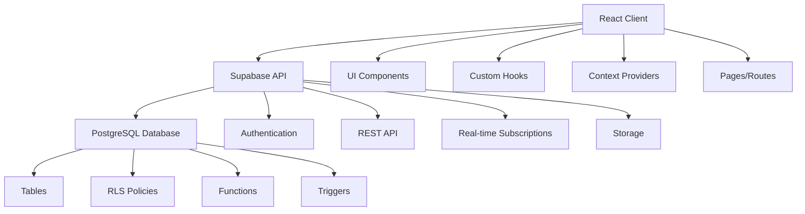

# ACRMS - Abelov Customer Relationship Management System Architecture

## Overview

ACRMS is a comprehensive Customer Relationship Management (CRM) and Service Management platform built with React, TypeScript, and Supabase. The application provides role-based access control for different user types including administrators, technicians, sales staff, and customers.

## Technology Stack

- **Frontend**: React 18, TypeScript, Vite
- **UI Framework**: Tailwind CSS, shadcn/ui components
- **Backend**: Supabase (PostgreSQL, Auth, Storage, Edge Functions)
- **State Management**: React Context, Custom Hooks
- **Authentication**: Supabase Auth with Row Level Security (RLS)
- **Routing**: React Router v6
- **Forms**: React Hook Form with Zod validation
- **Icons**: Lucide React
- **Charts**: Recharts
- **Notifications**: Sonner toast library

## System Architecture

The system follows a modern client-server architecture:

```
┌─────────────────┐    ┌──────────────────┐    ┌─────────────────┐
│   React Client  │    │   Supabase API   │    │   PostgreSQL    │
│                 │    │                  │    │    Database     │
├─────────────────┤    ├──────────────────┤    ├─────────────────┤
│ • Components    │◄──►│ • Authentication │◄──►│ • Tables        │
│ • Hooks         │    │ • REST API       │    │ • RLS Policies  │
│ • Context       │    │ • Real-time      │    │ • Functions     │
│ • Utils         │    │ • Storage        │    │ • Triggers      │
└─────────────────┘    └──────────────────┘    └─────────────────┘
```

### Component Architecture



## Project Structure

```
src/
├── App.tsx                 # Main application component with routing
├── main.tsx               # Application entry point
├── assets/                # Static assets (images, diagrams)
│   ├── diagrams/          # System architecture diagrams
│   └── *.jpg              # Hero and content images
├── components/            # Reusable UI components
│   ├── ui/                # shadcn/ui components
│   ├── AppSidebar.tsx     # Main application sidebar
│   ├── Layout.tsx         # Main layout component
│   ├── ProtectedRoute.tsx # Route protection component
│   ├── ThemeProvider.tsx  # Theme management
│   ├── ThemeToggle.tsx    # Theme toggle button
│   ├── ProfileDropdown.tsx # User profile dropdown
│   └── *.tsx              # Other shared components
├── hooks/                 # Custom React hooks
│   ├── useAuth.tsx        # Authentication state management
│   ├── useProfile.tsx     # User profile management
│   ├── useUserRole.tsx    # User role management
│   └── use-toast.ts        # Toast notification system
├── integrations/          # Third-party integrations
│   └── supabase/          # Supabase client and types
│       ├── client.ts      # Supabase client configuration
│       └── types.ts       # Generated TypeScript types
├── lib/                   # Utility functions
│   ├── currency.ts        # Currency formatting utilities
│   └── utils.ts           # General utility functions
├── pages/                 # Page components
│   ├── Index.tsx          # Index page with role-based routing
│   ├── Landing.tsx        # Public landing page
│   ├── Auth.tsx           # Authentication page
│   ├── Dashboard.tsx      # User dashboard
│   ├── ServiceRequest.tsx # Service request creation
│   └── *.tsx              # Other page components
└── routes/                # Route definitions (if exists)
```

## Core Components

### Authentication System

The authentication system is built on Supabase Auth with custom React hooks:

- `useAuth` - Main authentication hook providing sign in, sign up, and sign out functionality
- `useUserRole` - Manages user roles and permissions
- `useProfile` - Handles user profile data
- `ProtectedRoute` - Component for protecting routes based on user roles

### State Management

The application uses a combination of React Context and custom hooks for state management:

1. **Authentication Context** - Global authentication state
2. **Theme Context** - Dark/light mode management
3. **Custom Hooks** - Encapsulated state logic for specific features

### Component Structure

The UI is organized into:

1. **Layout Components** - AppSidebar, Layout, Header
2. **Page Components** - Individual pages for each route
3. **Feature Components** - Specialized components for specific features
4. **UI Components** - Reusable UI elements from shadcn/ui
5. **Form Components** - Specialized form handling components

## Data Flow

1. **User Authentication**
   - User signs in through Auth page
   - Supabase Auth handles authentication
   - User role is fetched from user_roles table
   - Role-based routing directs user to appropriate dashboard

2. **Service Request Lifecycle**
   - User creates request through ServiceRequest page
   - Request is stored in service_requests table
   - Technicians can view and accept requests
   - Status updates are tracked through activity_logs
   - Completion triggers notifications

3. **Data Management**
   - All data is stored in Supabase PostgreSQL database
   - Real-time subscriptions for live updates
   - Row Level Security (RLS) enforces data access rules
   - Image uploads stored in Supabase Storage

## Role-Based Access Control

### Roles
- **Admin**: Full system access
- **Technician**: Job request management
- **Sales**: CRM functionality
- **User**: Personal dashboard and requests

### Implementation
- Role checking in ProtectedRoute component
- Database-level RLS policies
- UI elements conditionally rendered based on role

## Security Features

- **Row Level Security (RLS)** - Database access control
- **Role-based Access Control** - Feature restrictions by user role
- **Secure Authentication** - Supabase Auth integration
- **Data Validation** - Zod schema validation
- **Image Upload Security** - Secure file storage

## Styling and UI

- **Tailwind CSS** - Utility-first CSS framework
- **shadcn/ui** - Accessible UI components
- **Dark/Light Mode** - Theme switching with localStorage persistence
- **Responsive Design** - Mobile-first approach
- **Animations** - CSS animations and transitions

## Database Schema

### Core Tables
- `profiles` - User profile information
- `user_roles` - Role assignments
- `service_requests` - Service request management
- `assets` - Asset tracking
- `activity_logs` - System audit trail
- `notifications` - User notifications

## Deployment

The application is designed for easy deployment with Vite and can be hosted on platforms like Vercel, Netlify, or similar services.

## Performance Considerations

- **Code Splitting** - Route-based code splitting
- **Image Optimization** - Properly sized images
- **Caching** - HTTP caching strategies
- **Bundle Optimization** - Tree shaking and minification